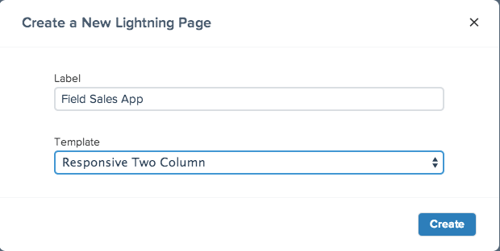
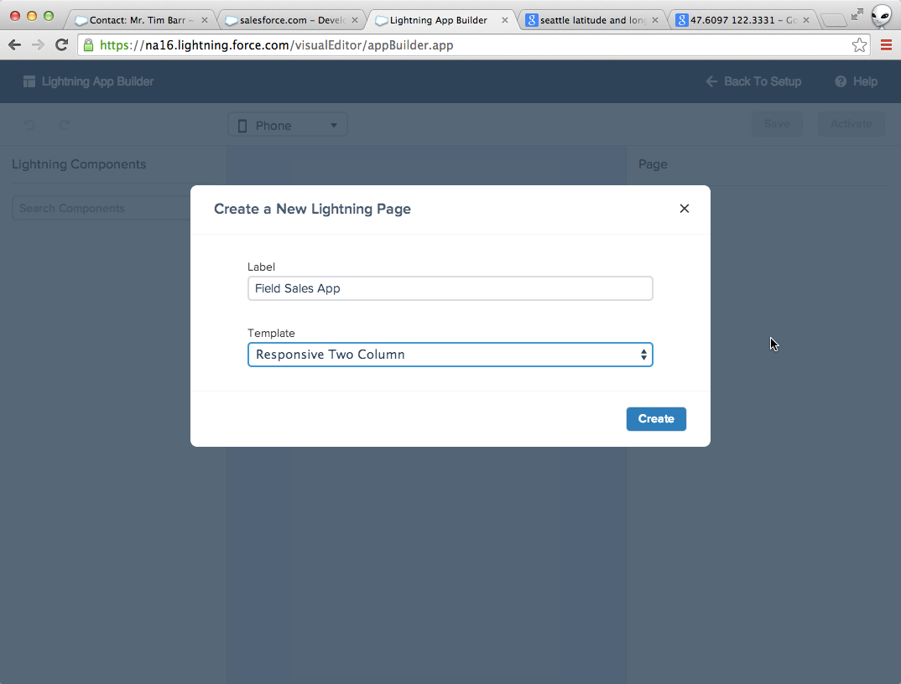

This module gives a quick tour of the Lightning App Builder.  

## Step 1: Create your first Lightning Page in Lightning App Builder

> When creating a new Lightning Page you will be presented with a popup. In this popup you will supply a unique name for your new page and select the type of template to use.  
> 
> 
> 
> A template defines the basic behavior and layout of the page you plan to create.   
> 
> Once you have provided the information in the popup, the Lightning App Builder loads, but your page will not save until you click **Save**. 

1. In the **Setup** menu, select ** Build > Lightning App Builder**

2. Click **New** under **Lightning Pages** to start Lightning App Builder

3. In the *Create a New Lightning Page* pop-up, set the following values and click **Create**:

- **Label:** Field Sales App
- **Template:** Responsive Two Column

## Step 2: Tour the Lightning App Builder

You are now in the Lightning App Builder tool which is comprised of the following features:

A. The canvas is the area where you build your Lightning Page. Pages are assembled by dragging components from the left side bar (see _B_ and _C_) onto the canvas in the center. Editable sections are determined by the template chosen. These sections marked by boxes that initially are labeled _Add Component(s) Here_. Each box can have many components added to it. 

B. Standard Lightning components provided by Salesforce with Lightning App Builder.

C. Custom Lightning components. These will either be built by programmers in your org, deployed using the metadata API, or installed from AppExchange packages. 

D. The preview picklist changes the form factor of the canvas so you can get an idea of how your page will display on different devices. Currently you can toggle between *Phone* and *Tablet*. Each template behaves differently when preview mode changes. 

E. Controls for the App Builder. **Save** the current definition of your app. **Activate** adds your app the the Saleforce1 Mobile navigation. **Back To Setup** exits Lightning App Builder and returns you to the list of Lightning Apps. **Help** launches the online help for Lightning App Builder.

F. Attributes for the currently selected item. This can either be for the page itself, in which case the title will indicate **Page**. Otherwise you can set attributes for individual components. In this instance the title will indicate **Page > [SelectedComponent]**. 

G. Selected publisher actions for this Page. Only global publisher actions are allowed in a Lightning App Builder App. Actions must be defined before you use them in your app by going to **Setup > Create > Global Actions > Actions**.

<a href="setup-environment.html" class="btn btn-default"><i class="glyphicon glyphicon-chevron-left"></i> Previous</a>
<a href="create-lightning-application.html" class="btn btn-default pull-right">Next <i class="glyphicon glyphicon-chevron-right"></i></a>

