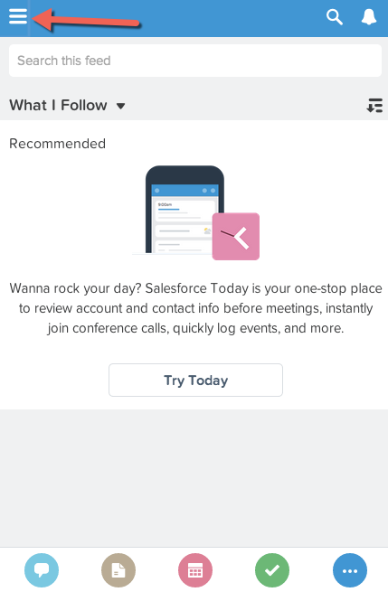
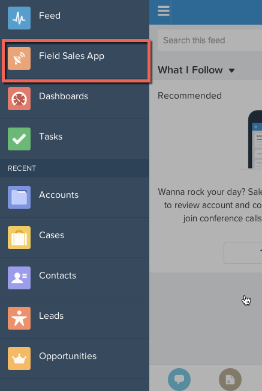

In this module, you test the new, active Lightning App in the mobile environment. This is useful when building mobile apps in Salesforce production and test environments, as it allows you to see the mobile experience that your end users will have. For this example you can either use the Chrome desktop browser on your computer in a mobile view, or you can use the Salesforce1 Mobile app in your smartphone. Instructions will be provided for testing in the Chome Mobile view. 

## What you will learn
- How to test salesforce development for mobile users using either the Chrome browser or the Salesforce1 Mobile App. 

## Step 1: Switch to Chrome Mobile View

1. If you are not already, login to your salesforce environment in the Chrome browser. Take a look at the URL address in the browser. 
2. Add /one/one.app to the end of your URL of the domain your Salesforce instance is on. If your Developer Edition is located on na15, meaning when you log in you URL looks something like https://na15.salesforce.com/home/home.jsp. To navigate to the Salesforce1 mobile app view, change the /home/home.jsp to /one/one.app. 
Your screen will now show the Salesforce mobile view. 

3. You can resize your browser window now to a smaller size, more similar to a mobile screen. 

## Step 2: Navigate to our new Mobile App 
When we activated our new Lightning App, we defined where it would be placed in the Salesforce1 navigation panel. 
1. Click on the icon in the upper left corner of your screen to open the sidebar navigation 

2. Select the tab named **Field Sales App**

Congratulations! In just a few minutes you created a Lightning App in Salesforce, added multiple actions, and tested for mobile users, all without a single line of code!

<a href="create-searchbar-component.html" class="btn btn-default"><i class="glyphicon glyphicon-chevron-left"></i> Previous</a>
<a href="next.html" class="btn btn-default pull-right">Next <i class="glyphicon glyphicon-chevron-right"></i></a>

