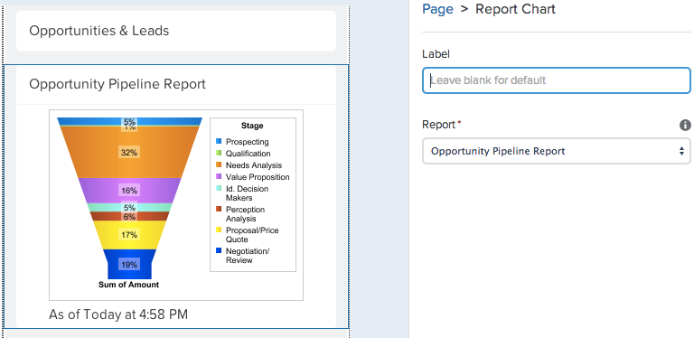
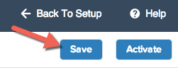

The Lightning App Builder makes it easy to display report data with the Report Chart standard component. In this module, you will display the Opportunity Pipeline report chart in your Sales Health app so that your Sales Reps always have that data from any custom report chart just one tap away.

## What you will learn
- How to display a Salesforce Report Chart in a Lightning Page

## Step 1:

1. Drag the **Report Chart** component from the **Standard Components** in the left hand side bar and place it below the Recent Items list in the right hand column of the canvas. 

3. In the right side bar look for the attributes to set for this components. Set the following values: 
- **Label:** Leave this blank. The label of the Report Chart will display by default.
- **Report:** Opportunity Pipeline Report. 

- *Because we only have one custom report chart currently created, it will default to this report chart. Any report charts that you have access to will be avaiable in the report picklist.*

6. Click **Save** to save your app.  

<a href="create-lightning-application.html" class="btn btn-default"><i class="glyphicon glyphicon-chevron-left"></i> Previous</a>
<a href="create-searchbar-component.html" class="btn btn-default pull-right">Next <i class="glyphicon glyphicon-chevron-right"></i></a>

