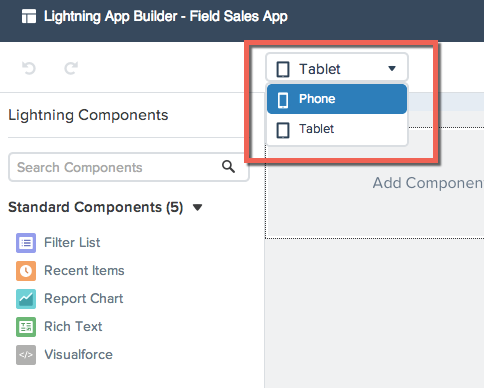
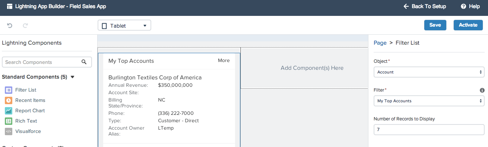
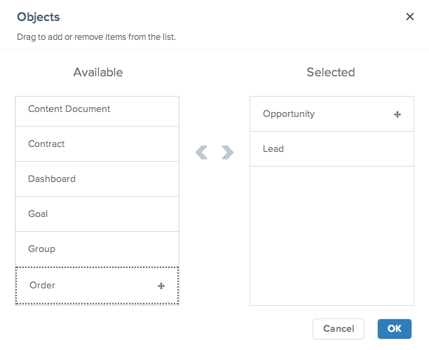

Now you are ready to compose an app in the Lightning App Builder using standard and custom components. In this module you will start by adding a few lists to your Sales Health app.

## What you will learn
- How to add a Filter List component to a Lightning App 
- How to add a Recent Items component to a Lightning App 
- How to add a custom component to a Lightning App 

## Step 1: Add Filter List for My Top Accounts

1. Switch the preview picklist from **Phone** to **Tablet**. This will change the layout of the canvas from the standard single column to the the two column preview.

2. Drag the **Filter List** component from the **Standard Components** in the left hand side bar and place it on the left hand column of the canvas. 

3. In the right side bar look for the properties to set for this components. Set the following values: 
- **Object:** Account
- **Filter:** My Top Accounts
- **Number of Records to Display:** 7
- 

## Step 2: Add Recent Opportunities & Leads

1. Drag the **Recent Items** component to the right hand column of the canvas. 

2. Note how the right side bar has now updated with the component properties and the title now indicates **Page > Recent Items**. In the right side bar set the following values: 
- **Label:** Opportunities & Leads
- **Objects:** Click **Select** and drag `Opportunity` and `Lead` to the *Selected* column on the right then click **Ok**.

## Step 3: Add My Nearby Contacts list (custom component)

1. From the Custom Components list in the left hand side bar, drag the My Nearby Contacts component onto the canvas under the Account Filter List. In the right side bar set the **Max Distance** value to `50`.

2. Click **Save** to save your app. Note that the **Activate** button is now available. 

<a href="create-apex-controller.html" class="btn btn-default"><i class="glyphicon glyphicon-chevron-left"></i> Previous</a>
<a href="create-contactlist-component.html" class="btn btn-default pull-right">Next <i class="glyphicon glyphicon-chevron-right"></i></a>

