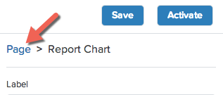
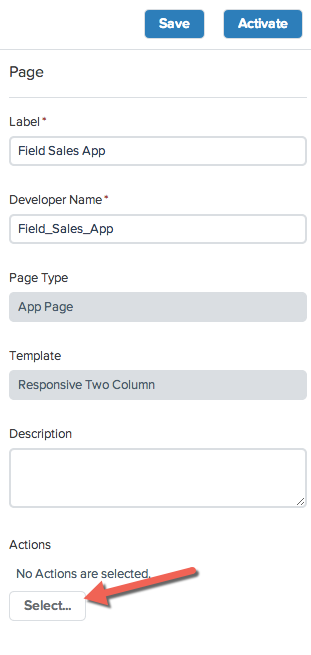
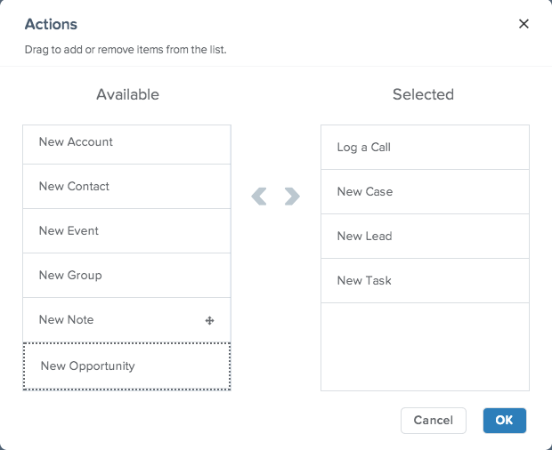
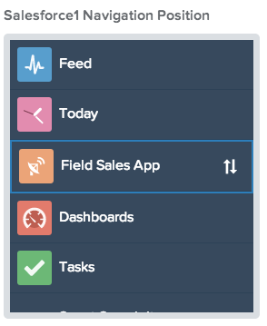

In this module, you will put the final touches on your Sales Health app by give the Sales Reps a quick way to Log a Call, Create a new Case, Add a new Lead, and set a Task while in your app. Then, you will activate your app and add it to the Salesforce1 Mobile App navigation.

## What you will learn

- How to add Global Actions to a Lightning Page
- How to add a Lightning Page to the Salesforce1 Mobile App

## Step 1: Add Actions

Actions are shortcuts that allow Salesforce1 Mobile App users to quickly create and modify records. In order for users to create common sales records, we will add a few standard actions. 

1. In the right hand side bar, click on the word **Page**. This will make the app properties available for configuration. 

   
2. At the bottom of the right side bar, under Actions, click **Select...**.
3. 

3. From the **Available** list, drag the **Log a Call**, **New Case**, and **New Lead** and **New Task** quick actions to the **Selected** list. 

    

4. Click **Ok** to add the action to your Lightning Page. 

> The **Actions** property at the bottom of the right hand nav should now show the `LogACall`, `NewCase`,`NewLead` and `NewTask` actions. 

5. At the upper right of App Builder, click **Save**. 

## Step 2: Activate the App

>The **Activate** feature allows the application builder to enable the app in the user interface without leaving Lightning App Builder. It bundles the standard Salesforce tab feature normally found at _Setup > Create > Tabs > Lightning Page Tabs_ and automatically adds the tabs to the Salesforce1 Mobile navigation configuration normally found in _Setup > Mobile Administration > Mobile Navigation_. 

1. Click **Activate** to add it to the Salesforce1 Mobile Navigation. 

2. Set **Tab Label** to `Field Sales`.

3. Next to the **Tab Icon** click **Change...**.

4. Select any icon you prefer. This will close the Tab Icon window and change the icon displayed in the Activate window. 

5. In the Salesforce1 Navigation Position Pane on the right, drag the **Field Sales** Salesforce1 Navigation Position to just below the **Today** tab. 

6. Click **Activate**.

Your app is ready for testing.

<a href="create-contactlist-component.html" class="btn btn-default"><i class="glyphicon glyphicon-chevron-left"></i> Previous</a>
<a href="create-contactdetails-component.html" class="btn btn-default pull-right">Next <i class="glyphicon glyphicon-chevron-right"></i></a>

