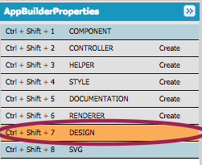
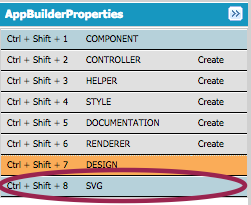
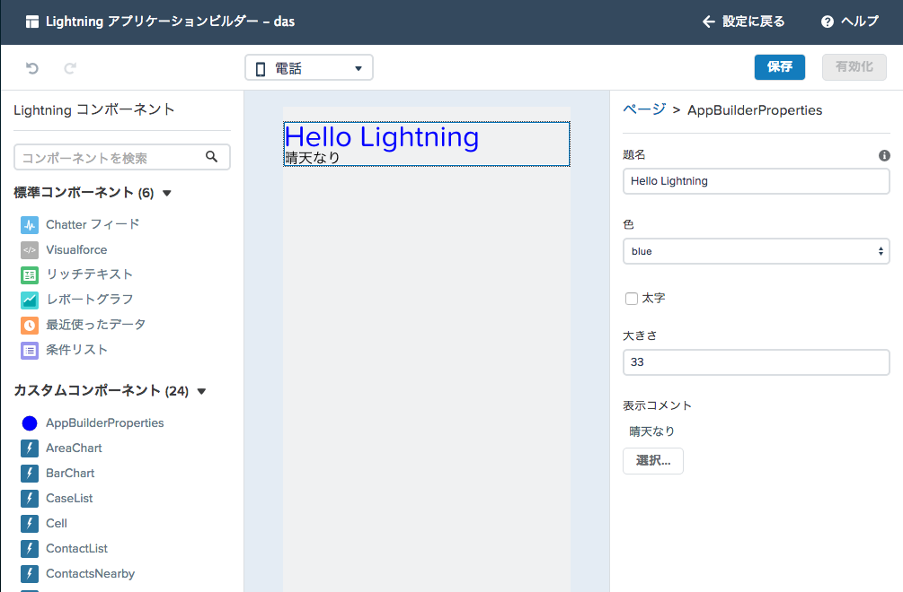

このモジュールでは、カスタムLightningコンポーネントがアプリケーションビルダーで表示された際のプロパティやアイコン表示を確認します。

## 何を学ぶことができるか

- Lightningアプリケーションビルダー上からカスタムコンポーネントの設定をおこなう

## ステップ 1: Lightningコンポーネントの作成

1. 開発者コンソールにて **File** > **New** > **Lightning Component** をクリックします。 **AppPropertiesSample** をバンドル名に設定し **Submit** をクリックします。

2. コンポーネントを以下のように入力します:

    ```
    <aura:component implements="flexipage:availableForAllPageTypes">
        <aura:attribute name="subject" type="String" default="Hello Lightning" />
        <aura:attribute name="color" type="String" default="red" />
        <aura:attribute name="bold" type="Boolean" default="false" />
        <aura:attribute name="size" type="Integer" default="12" />
        <aura:attribute name="comments" type="String[]" />
        <div style="{!'color:' + v.color + ';font-size:' + v.size + 'px'}">
    	    <h1>{!v.subject}</h1>
        </div>
        <aura:iteration items="{!v.comments}" var="commnet">
            {!commnet}
        </aura:iteration>
    </aura:component>
    ```

1.  **File** > **Save** をクリックしファイルを保存します。


## ステップ 2: デザインの実装

1. **Design** をクリックします。

    

1. デザインを以下の様に実装します:

    ```
    <design:component>
        <design:attribute name="subject" label="題名" description="ページに表示されるタイトルを入力します" />
        <design:attribute name="color" label="色"  />
        <design:attribute name="bold" label="太字"  />
        <design:attribute name="size" label="大きさ"/>
        <design:attribute name="comments" label="表示コメント"/>
    </design:component>
    ```

    ### コードハイライト:
    - デザインではアプリケーションビルダーで表示されるプロパティを定義することが可能です。
    - name属性は、コンポーネントのattributeとして定義されている項目をしていします。
    - サーバへのfindAll() メソッド呼び出しは非同期に行われるので、この場合実行結果が戻ってきた際のコールバック関数を定義します。コールバック関数内では、シンプルに取引先責任者のリストをコンポーネントの **contacts** 属性にアサインしています。

1. **File** > **Save** をクリックしてファイルを保存します。

## ステップ 3: SVGの実装

1. **SVG** をクリックします。

    

1. SVGを以下の様に実装します:

    ```
    <?xml version="1.0"?>
    <!DOCTYPE svg PUBLIC "-//W3C//DTD SVG 1.1//EN"
      "http://www.w3.org/Graphics/SVG/1.1/DTD/svg11.dtd">

    <svg xmlns="http://www.w3.org/2000/svg"
         width="600" height="600">
      <circle cx="300" cy="300" r="250" stroke="black"
        stroke-width="5" fill="blue" />
    </svg>
    ```
1. **File** > **Save** をクリックしてファイルを保存します。

## ステップ 4: Lightningアプリケーションビルダーより確認する

1. アプリケーションビルダーより、AppPropertiesSampleのアイコンの変化と、ドラッグ & ドロップすると、右ペインよりプロパティを編集できることを確認します。



<div class="row" style="margin-top:40px;">
<div class="col-sm-12">
<a href="swho-custom-component.html" class="btn btn-default"><i class="glyphicon glyphicon-chevron-left"></i> 戻る</a>
<a href="next.html" class="btn btn-default pull-right">次へ <i class="glyphicon glyphicon-chevron-right"></i></a>
</div>
</div>
