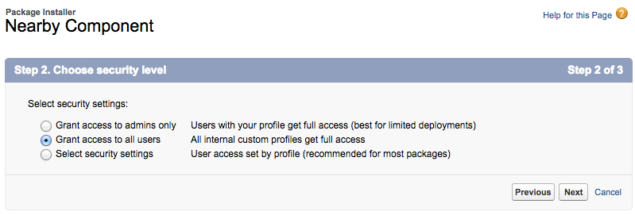
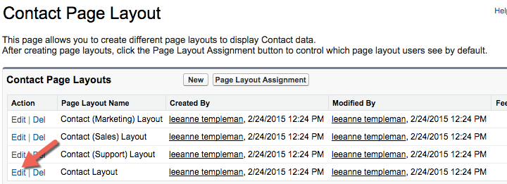
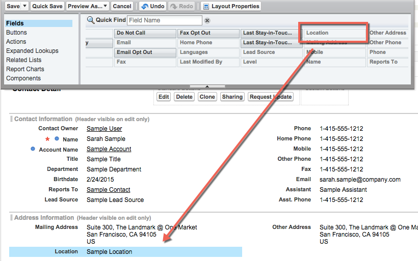
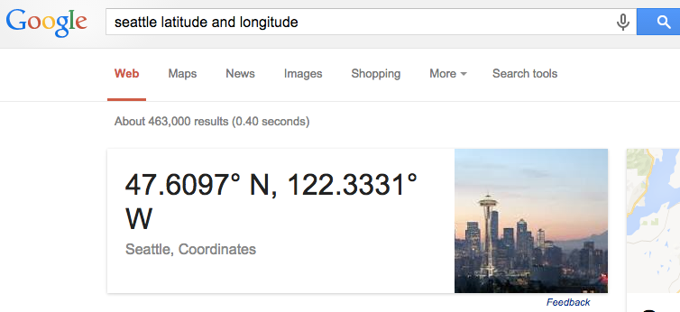
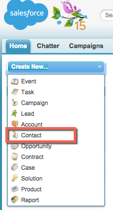
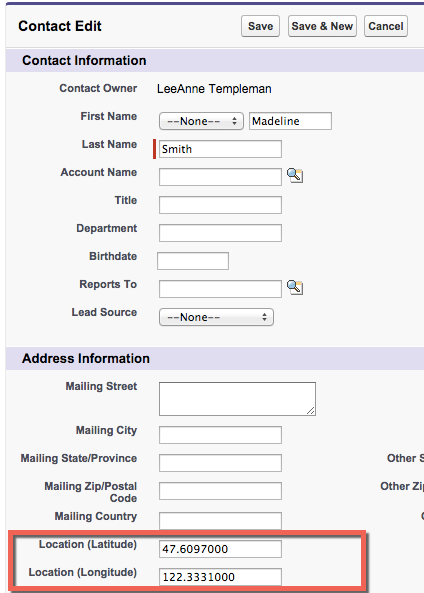

In this module, you set up your environment to enable Lightning App development.

## What you will learn
- Enable Lightning Components in your Salesforce org
- Upload Static Resources for use in your Lightning application
- Install Custom Component

## Step 1: Enable Lightning Components

1. In Setup, click **Develop** > **Lightning Components**

1. Check the **Enable Lightning Components** checkbox

    

1. Click **Save**

## Step 2: Install Custom Component Package 

1. Copy and paste the URL **http://bit.ly/InstallComponent** unto the address bar of your browser
1. Select **Continue** on the Package Installation Details screen
1. Select **Next** on the Approve Package API Access screen
1. Select **Grant access to all users** on the Security Level screen. 

1. Select **Next**
1. Select **Install** 

##Step 3: Add Custom Field to Contact Page Layout 
1. Go to **Setup | Build | Customize | Contacts | Page Layouts**
2. Select **Edit** next to the Contact Layout on the last row

3. Drag the **Location** field from the upper tray of available fields and drop it into the Address section of the page layout. 

4. Click **Save**

##Step 4: Create Sample Contacts with Locations
We are going to create new contacts in our Salesforce environment and populate information into the geolocation field included in the package we just installed. This will allow our component to map the location of the contacts in our final Lightning App . 

1. First, open a new tab to wwww.google.com and look up the Latitude and Longitude of the city you are currently in. Most major cities will automatically show the coordinates in the front page of your google search. 

2. In your Salesforce tab, navigate to the **Home** tab. 
3. In the left navigation of your salesforce home screen, select the drop down for **Create New Contact**

4. Make up any contact name you would like, and scroll down the page to the address area, where you will see the Latitude and Longitude fields. Enter the Latitude and Longitute numbers from your google search into the fields on the new contact, omitting the **N** and **W**. The Latitude will be the first resulting number in your google search, and the longitude the second number. 
5. Click **Save**
6. Create 2 more contacts with locations near your main city. 
7. **Extra Credit** Look up the coordinates for a city 500-1500 miles away from your current location, create some contacts with coordinates in those other locations as well. 

<a href="create-developer-edition.html" class="btn btn-default"><i class="glyphicon glyphicon-chevron-left"></i> Previous</a>
<a href="create-apex-controller.html" class="btn btn-default pull-right">Next <i class="glyphicon glyphicon-chevron-right"></i></a>

