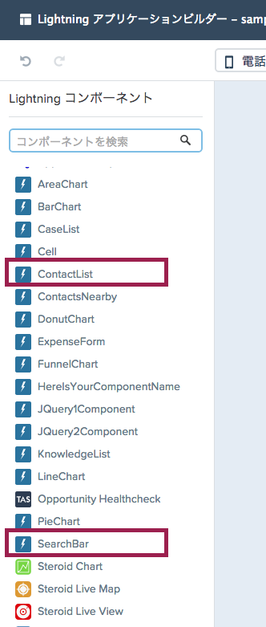

このモジュールでは、Lightning コンポーネントチュートリアルで開発したコンポーネントをアプリケーションビルダーに表示し、作成したコンポーネントをドラッグ & ドロップで表示できることを確認します。

## 何を学ぶことができるか

- Lightningアプリケーションビルダーでカスタムコンポーネントを利用する

## ステップ 1: Lightningコンポーネントの更新


1. SearchBarコンポーネントを以下のように更新します:

    ```
    <aura:component implements="flexipage:availableForAllPageTypes">

        <div>
            <input type="text" class="form-control"
                    placeholder="Search" onkeyup="{!c.searchKeyChange}"/>
        </div>

    </aura:component>
    ```

1. ContactListコンポーネントを以下のように更新します:

    ```
    <aura:component controller="ContactListController" implements="flexipage:availableForAllPageTypes">

        <aura:attribute name="contacts" type="Contact[]"/>
        <aura:handler name="init" value="{!this}" action="{!c.doInit}" />

        <ul>
            <aura:iteration items="{!v.contacts}" var="contact">
                <li>
                    <a href="{! '#/sObject/' + contact.Id + '/view'}">
                        <p>{!contact.Name}</p>
                        <p>{!contact.Phone}</p>
                    </a>
                </li>
            </aura:iteration>
        </ul>

    </aura:component>
    ```

    ### コードハイライト:
    - aura:componentタグ(コードの一行目)のimplements属性を設定することで、コンポーネントをどこで利用可能になるかを定義します。
    - **implements="flexipage:availableForAllPageTypes"** 設定を行うことで、コンポーネントがアプリケーションビルダーで有効化されます。

1.  **File** > **Save** をクリックしファイルを保存します。

## ステップ 2: カスタムLightningコンポーネントをアプリケーションビルダーから利用

1.  アプリケーションビルダーより、SearchBarコンポーネント及びContactListコンポーネントがドラッグ & ドロップできるようにになっていることを確認します。
 

<div class="row" style="margin-top:40px;">
<div class="col-sm-12">
<a href="create-contactdetails-component.html" class="btn btn-default"><i class="glyphicon glyphicon-chevron-left"></i> 戻る</a>
<a href="custom-component-design.html" class="btn btn-default pull-right">次へ <i class="glyphicon glyphicon-chevron-right"></i></a>
</div>
</div>
